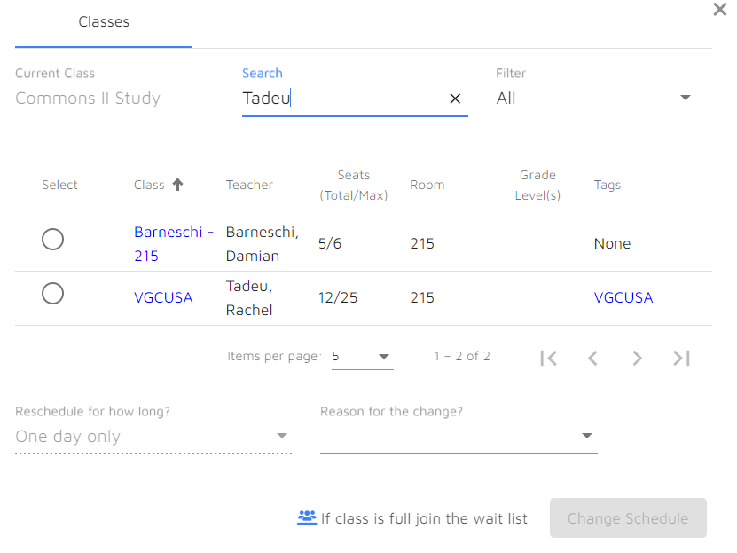
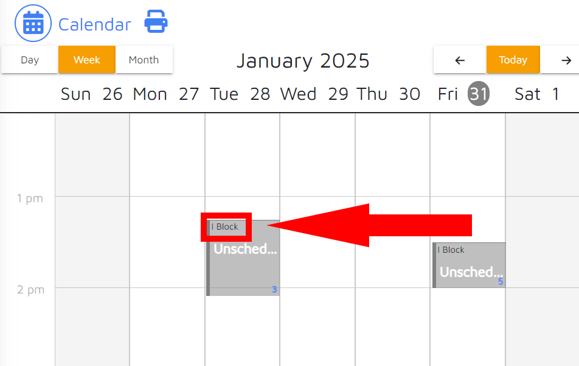

# MyFlex Automation

MyFlex Automation is a configurable Node.js program designed to automate Flex Block enrollment using Selenium's browser automation tools.

## Usage

Prerequisites:

- [Node.js](https://nodejs.org/en/download/prebuilt-installer)
- [Google Chrome](https://www.google.com/chrome/)
- A decent internet connection

### Foreword

Since MyFlex lacks an API, MyFlex Automation relies on browser automation tools to emulate user actions in order to schedule Flex Blocks. Part of this workflow involves logging in to the user's Google account by entering unencrypted credentials, which the program must store in order to operate. For this reason, **it is strongly advised that you deploy this program as a local instance.** This program is designed to run continously, checking every 24 hours (by default) for new Flex Blocks to have opened for enrollment. My personal recommendation is to host this software on something like an old laptop you leave on and plugged in.

### Instructions

Ensure you have downloaded the programs listed under Prerequisites. Then:

1. Download the source code archive of the [latest release](https://github.com/TaintedPhoenix/MyFlex-automation/releases/latest).
2. Extract the file to a directory of your choice.
3. Open the `config.json5` file in a text editor.
4. Set up your desired enrollment agenda according to the specification below and save the file.
5. Launch the program by executing  `run.bat` on Windows devices and `run.sh` on MacOS/Linux devices.
6. Input your Google Email and Password when prompted (These will be saved locally to the `.env` credentials file for future launches).
7. Ensure that the program is able to log in successfully by watching the output.

## Configuration

The config options (including the enrollment agenda) for the program can be found in `config.json5`. Each parameter is detailed below. The default `config.json5` looks like this:

```yaml
{
    "agenda" : {},
    "eventTitle" : "I Block",
    "interval" : 86400000,
    "loggingEnabled" : true,
    "outputEnabled" : true
}
```

### Options List

#### agenda

The most important config option is the enrollment agenda. You **must** alter this option in order for the program to function. It is an object/dictionary of members that describe what blocks the program should enroll in and when. An example member of agenda is:

```yaml
"6" : {
    "query" : "Tadeu",
    "name" : "VGCUSA",
    "teacher" : "Tadeu",
    "room" : "215" 
}
```

In this example `"6"` is the `cycle-day` for which the program will search for the associated Flex Block. You **must** set a Flex Block for each cycle-day on which they can occur. You do not have to set the same Flex Block for every cycle-day. The Flex Block contains a set of specific key-value pairs.

The only required Flex Block parameter is `query`, the text to be entered into the search box that will make the desired block appear in the Block List on the MyFlexLearning Website. In this example, the desired block is "VGCUSA", and the query that would be entered into the config is "Tadeu".



At least one of the other three parameters (`name`, `teacher`, `room`) is required. This information is used to select the desired block from the ones remaining after the search query. Their names are self explanatory, but note that the `name` and `teacher` parameters only check that the Block Name or Teacher **includes** their value, not that it is an exact match. If more than one of these parameters are defined (Which is not necessary), the program will select the first block that matches **at least one** of the conditions, checking for a match to `name` first, then `teacher`, and finally `room`.

#### eventTitle

`eventTitle` also requires attention in order for the program to function as intended. This option defines the string the program will search for when checking for unscheduled blocks. It should be set to whatever title your school uses for unscheduled blocks on MyFlex. In this example, the title is "I-block":



#### interval

Sets the time (in milliseconds) between checks for newly opened Flex Blocks. The default is 86400000 milliseconds, equivalent to 24 hours. It is advised not to set this option lower than 3600000 milliseconds, equivalent to 1 hour, as such a short interval is almost always unnecessary.

#### loggingEnabled

Sets whether or not to record the program output to a log file. We **strongly** recommend keeping this enabled for the sake of error reporting, especially since the program is under active development. If needed, you can find your log files in the `logs` folder in the program's root directory.

#### outputEnabled

Sets whether or not to display non-critical messages from the program to the console. Non-critical messages are mostly just the program discerning what actions it is taking.

### Full Example

This is how a fully configured `config.json5` file could look:

```yaml
{
    "agenda" : { #User has Flex Blocks on cycle-days "3", "5", and "6"
        "3" : {
            "query" : "Tadeu", #Desired block can be found with query "Tadeu"
            "teacher" : "Tadeu" #Check for desired block with teacher "Tadeu"
        },
        "5" : {
            "query" : "Tadeu",
            "teacher" : "Tadeu"
        },
        "6" : {
            "query" : "Tadeu",
            "name" : "VGCUSA", #Check for desired block with name "VGCUSA" first,
            "teacher" : "Tadeu" #And if not found, check for block with teacher "Tadeu"
        }
    },
    "eventTitle" : "I Block", #User's School uses title "I Block" for unscheduled blocks
    "interval" : 86400000, #Check for newly-opened blocks every 24 hours
    "loggingEnabled" : true, #Write program output to a log file
    "outputEnabled" : true #Display non-critical program messages in the console 
}
```

## Error reporting

As MyFlex Automation is still in active development, it is prone to errors. If you encounter an error, please [open an issue on GitHub](https://github.com/TaintedPhoenix/MyFlex-automation/issues) (After checking that someone else hasn't already reported the same issue) and include a copy of your `config.json5` file and any relevant log files (usually `latest.txt`) which can be found in the `logs` folder, as well as a short description of the problem, and any other relevant information. Your contribution is greatly appreciated!

Additionally, if want to make any additions or changes to the program (especially to this `README.md`) that you believe would be beneficial, feel free to [create a Pull Request](https://github.com/TaintedPhoenix/MyFlex-automation/pulls) and submit your desired changes for review.

Thank you for using my software!

~TaintedPhoenix
